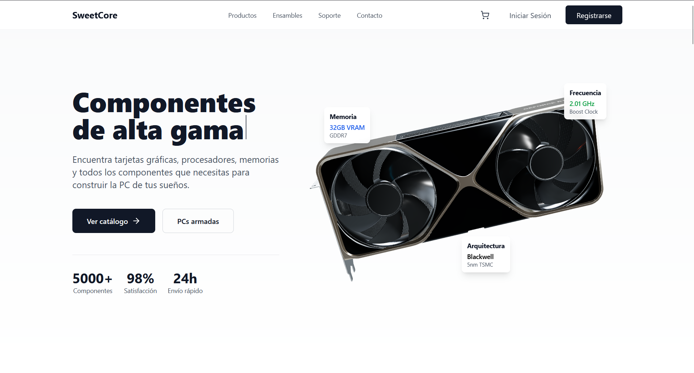
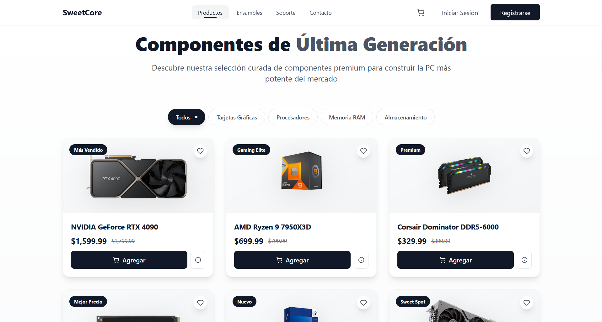
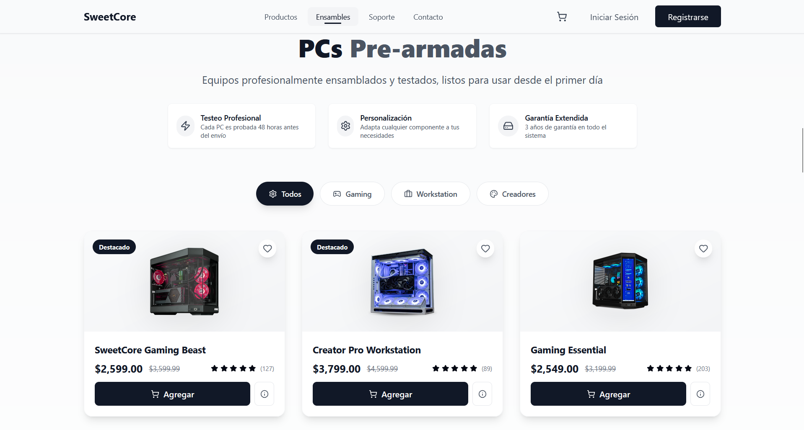

# SweetCore

**Tu destino definitivo para componentes de PC de alta calidad.**  
Construye la PC de tus sueños con los mejores productos, ensamblados o a la medida.  

🌐 [Ver sitio en línea](https://sweetcore.vercel.app/)  

---

## Vista previa

  
*Pantalla principal de SweetCore.*  

  
*Catálogo de componentes premium.*  

  
*Selección de PCs pre-armadas.*  

---

## Lo que ofrecemos

- Componentes Premium → Tarjetas gráficas, procesadores, memorias y más.  
- PCs Pre-armadas → Equipos ensamblados profesionalmente y testeados 48h.  
- Personalización Total → Adapta cualquier configuración a tus necesidades.  
- Envío Rápido 24h → Recibe tu pedido en tiempo récord.  
- Soporte 24/7 → Siempre disponible para ayudarte.  

---

## Ejemplos de productos

**Más vendidos**
- NVIDIA GeForce RTX 4090 — $1,599.99  
- AMD Ryzen 9 7950X3D — $699.99  
- Corsair Dominator DDR5-6000 — $329.99  
- Intel Core i9-14900K — $589.99  

**PCs destacadas**
- SweetCore Gaming Beast — $2,599.00  
- Creator Pro Workstation — $3,799.00  
- Budget Gaming Starter — $650.00  

---

## Tecnologías

- React → Framework moderno para la web.  
- TailwindCSS → Estilos rápidos y responsivos.  
- Vercel → Despliegue y hosting en la nube.  

---

## Instalación

```bash
# Clonar el repositorio
git clone https://github.com/AmiiGood/SweetCore.git
cd sweetcore

# Instalar dependencias
npm install

# Modo desarrollo
npm run dev

# Build de producción
npm run build
npm start
